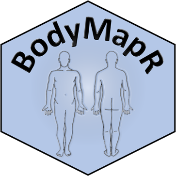

<!-- badges: start -->
<!-- badges: end -->

## Overview  
<b>BodyMapR</b> (pronounced "body mapper") an R package and Shiny application that generates anatomical visualizations of cancer lesions from structured data. The package centralizes around two core functions `bodymapr_df()` and `bodymapr_plot()` which transposes structured data from REDCap® onto an anatomical map to yield an interactive data visualization.

We have also created a front-end Shiny application that uses the core functions of <b>BodyMapR</b> on the server side of the app. The Shiny app of <b>BodyMapR</b> allows for an interactive component to facilitate user-directed data visualizations. The package does not require the use of the Shiny app, but the app enhances the usability of the package. The BodyMapR Shiny application is launched via the function `launch_BodyMapR()`. This function takes one argument, “Data”, a raw csv file exported from REDCap®. `launch_BodyMapR()` is the only function an end user needs to call to execute and utilize BodyMapR. Once launched, clinical researchers interface with BodyMapR in a web browser. 

A video demonstration of <b>BodyMapR</b> can be seen [here](https://www.dropbox.com/s/von8vny8t6zfkus/BodyMapR%20Video%20Demo.mov?dl=0).

<b>BodyMapR</b> provides a set of verbs that wrangle, process and graph clinical tumor characteristics from structured data:  

  | Verbs | Function |
  | :---        |    :---   |
|bodymapr_df()|creates a data frame of clinical tumor characteristics from a structured electronic data collection instrument (e.g. the Lesion Information instrument) and maps them to lookup tables that contain a coordinate system for the Body Map|
|bodymapr_plot()|creates an interactive data visualization of clinical tumor characteristics from a structured EDC lesion instrument that has been processed by bodymapr_df().|
|genomics.df.unite()|wrangles and processes genomics data from a REDCap project that has incorporated the Genomics Instrument. Genetic alterations are listed in wide format with a concatenation of genomic alterations in one cell. This function is called within BodyMapR's bodymapr_df() function.|
|genomics.df.long()|wrangles and processes genomics data from a REDCap project that has incorporated the Genomics Instrument. This allows for expedited analysis of patient-level data from REDCap. Genetic alterations are listed in long format. This function is called within BodyMapR's genomics.df.unite() function. |

## Dependencies
### Software Dependencies
<b>BodyMapR</b> is written in R (version 4.0.0), organized using roxygen2, and utilizes the following packages dplyr, tidyr, readr, stringr, purrr, magrittr, plotly, shinydashboard and Shiny.

### Clinical Informatics Dependencies  
<b>BodyMapR</b> facilitates data visualizations from structured data contained in the Lesion Information instrument stored within REDCap&#174; project. The data dictionary for this form has been previously published[@LesionInstrument]. <b>BodyMapR</b> also integrates clinico-genomic data from the Genomics data capture instrument, which is has been previously described([https://www.themillerlab.io/post/optimizing_rwd_collection-clinical_genomics) and is freely available on GitHub(https://github.com/TheMillerLab/genetex/blob/main/data-raw/genomics_data_dictionary.csv). 

## Installation

### Development version

To get a bug fix or to use a feature from the development version, you can install 
the development version of <b>BodyMapR</b> from GitHub.

`devtools::install_github("TheMillerLab/BodyMapR")`

## Usage
`library(BodyMapR)`

### BodyMapR Input  
<b>BodyMapR</b> takes data from a REDCap&#174; project that has incorporated the Lesion Information instrument as the input. This csv file is loaded into the Shiny application. End users control what information is displayed onto a Biorender-generated anatomical map via the application's sidebar in the <b>BodyMapR</b> browser-based user interface. 

### BodyMapR Output 
<b>BodyMapR</b> creates a plotly visualization, with topographical represenations of cancer lesions displayed on a BioRender-generated image using ggplot2.

## Getting help
If you encounter a clear bug, please file an issue with a minimal reproducible example on [GitHub](https://github.com/TheMillerLab/BodyMapR/issues).

## Disclaimer and Acknowledgements
<b>BodyMapR</b> is for research purposes only. No clinical decisions should be made with the information obtained from its output.
